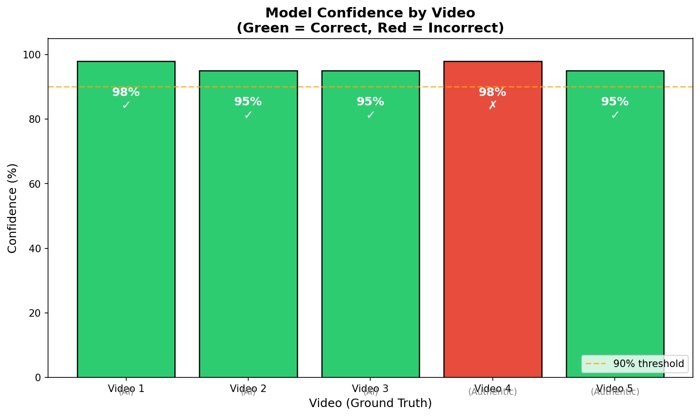
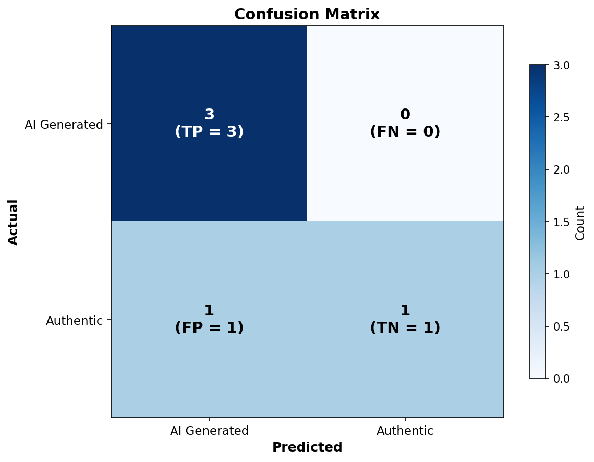

# Project 9 - AI Video Fraud Detection Agent

[](https://codecov.io/gh/YOUR_USERNAME/LLMCourseProject)
[](https://www.python.org/downloads/)

An experiment-based project that creates a security expert agent specialized in investigating video frauds. The agent analyzes videos or video frames and determines whether they were generated by AI (deepfakes, synthetic media) or are authentic footage.

## Table of Contents

- [Installation](#installation)
- [Running the Experiment](#running-the-experiment)
- [Usage](#usage)
- [Configuration](#configuration)
- [How It Works](#how-it-works)
- [Testing](#testing)
- [Project Structure](#project-structure)
- [Experiment Results](#experiment-results)
- [Costs](#costs)
- [License](#license)

## Installation

### Prerequisites

- Python 3.10+
- Ollama with a vision model (e.g., llava) for local inference
- OR OpenAI/Anthropic API key for cloud inference

### Setup Steps

```bash
# Clone the repository
git clone <repository-url>
cd project9

# Create virtual environment
python -m venv .venv
source .venv/bin/activate  # On Windows: .venv\Scripts\activate

# Install dependencies
pip install -r requirements.txt

# Copy environment configuration
cp .env.example .env
# Edit .env with your values (e.g., OLLAMA_HOST)
```

### Ollama Setup (Recommended)

```bash
# Install Ollama (https://ollama.ai)
# Pull a vision model
ollama pull llava
```

## Running the Experiment

Follow these steps to run the video fraud detection experiment:

### Step 1: Prepare Your Videos

Place your test videos in the `videos/` folder:

```bash
videos/
├── video_1.mp4    # Your first test video
├── video_2.mp4    # Your second test video
└── ...            # Add as many as needed
```

### Step 2: Start Ollama

Make sure Ollama is running with the llava model:

```bash
# Start Ollama server (if not already running)
ollama serve

# In another terminal, verify llava is available
ollama list
```

### Step 3: Run Analysis on Videos

**Analyze a single video:**
```bash
python -m src.main --video videos/video_1.mp4 --frames 5
```

**Analyze with more frames for better accuracy:**
```bash
python -m src.main --video videos/video_1.mp4 --frames 10
```

**Get JSON output for programmatic processing:**
```bash
python -m src.main --video videos/video_1.mp4 --json > results/video_1_result.json
```

**Batch analyze all videos:**
```bash
# Analyze all videos in the folder
for video in videos/*.mp4; do
    echo "Analyzing: $video"
    python -m src.main --video "$video" --json
    echo "---"
done
```

### Step 4: Generate Visualizations

After collecting results, generate analysis graphs:

```bash
python scripts/generate_visualizations.py
```

This creates charts in `results/figures/`.

### Alternative: Manual Analysis with External LLM

If you prefer to use an external LLM (GPT-4V, Claude, Gemini):

1. Open `docs/llm-video-analysis-prompt.md`
2. Copy the system prompt to your LLM
3. Upload video frames and use the analysis prompt
4. Collect JSON responses in the same format

## Usage

### Analyze a Single Image/Frame

```bash
# Basic analysis
python -m src.main --image path/to/frame.jpg

# With JSON output
python -m src.main --image path/to/frame.jpg --json

# Using a specific model
python -m src.main --image path/to/frame.jpg --model llava:13b
```

### Analyze a Video (Coming Soon)

```bash
# Analyze video with 5 sampled frames
python -m src.main --video path/to/video.mp4 --frames 5
```

### Command Line Options

| Option | Description | Default |
|--------|-------------|---------|
| `--image` | Path to image/frame to analyze | - |
| `--video` | Path to video file to analyze | - |
| `--frames` | Number of frames to sample from video | 5 |
| `--provider` | LLM provider (ollama, openai, anthropic) | ollama |
| `--model` | Model name to use | llava |
| `--json` | Output results as JSON | False |

## Configuration

### Environment Variables

Set in `.env`:

```bash
# Ollama configuration
OLLAMA_HOST=http://localhost:11434

# Logging
LOG_LEVEL=INFO
```

## How It Works

The agent acts as a senior security expert in digital forensics. When analyzing content, it examines:

1. **Facial Analysis**: Unnatural movements, lighting inconsistencies, blurring
2. **Temporal Consistency**: Flickering, shadow inconsistencies, motion blur
3. **Technical Artifacts**: Compression anomalies, resolution issues, color banding
4. **Contextual Analysis**: Background consistency, lighting direction, reflections

### Output

The agent returns:
- **Verdict**: `AI_GENERATED`, `AUTHENTIC`, or `UNCERTAIN`
- **Confidence**: 0-100% confidence in the verdict
- **Reasoning**: Detailed explanation of the analysis
- **Indicators**: Specific signs found during analysis
- **Recommendations**: Suggestions for further investigation

## Testing

```bash
# Run all tests
pytest tests/ -v

# Run with coverage
pytest tests/ --cov=src --cov-report=term-missing
```

## Project Structure

```
project9/
├── README.md                    # This file
├── CLAUDE.md                    # Claude context file
├── requirements.txt             # Python dependencies
├── pyproject.toml               # Package configuration
├── .gitignore                   # Git ignore rules
├── .env.example                 # Configuration template
│
├── src/                         # Source code
│   ├── __init__.py
│   ├── agent.py                 # VideoFraudDetectionAgent
│   └── main.py                  # CLI entry point
│
├── docs/                        # Documentation
│   ├── prompts.md               # Agent prompts documentation
│   ├── llm-video-analysis-prompt.md  # External LLM prompt
│   ├── architecture.md          # System architecture
│   └── research.md              # Research methodology
│
├── videos/                      # Test videos
│   ├── vidoe_1.mp4              # AI-generated
│   ├── video_2.mp4              # AI-generated
│   ├── video_3.mp4              # AI-generated
│   ├── video_4.mp4              # Authentic
│   └── video_5.mp4              # Authentic
│
├── results/                     # Experiment outputs
│   ├── experiment_results.md    # Full analysis report
│   ├── figures/                 # Visualizations
│   │   ├── confidence_by_video.png
│   │   ├── confusion_matrix.png
│   │   └── performance_metrics.png
│   └── metrics/
│       └── experiment_metrics.json
│
├── scripts/                     # Utility scripts
│   └── generate_visualizations.py
│
├── tests/                       # Test suite
│   ├── __init__.py
│   └── conftest.py
│
└── config/                      # Configuration files
```

## Experiment Results

### Overview

We tested the agent on a dataset of 5 videos:
- **3 AI-generated videos** (Videos 1-3)
- **2 authentic videos** (Videos 4-5)

### Performance Summary

| Metric | Value |
|--------|-------|
| **Accuracy** | 80% (4/5) |
| **Precision** | 75% |
| **Recall** | 100% |
| **F1 Score** | 0.857 |

### Model Confidence by Video



The chart shows model confidence for each video. Green bars indicate correct predictions, red indicates incorrect. The model achieved high confidence (95-98%) across all predictions, but notably the one error (Video 4) also had 98% confidence - indicating a calibration issue.

### Confusion Matrix



The model correctly identified all AI-generated videos (100% recall) but produced one false positive - classifying an authentic video as AI-generated.

### Key Findings

1. **High Recall**: The model detected all 3 AI-generated videos correctly
2. **False Positive Risk**: Complex motion in authentic videos can trigger false AI detection
3. **Confidence Calibration**: High confidence doesn't always correlate with correctness
4. **Common AI Indicators**: Morphing artifacts, anatomical inconsistencies, and temporal flickering were the most frequently detected signs

### Detailed Results

See [`results/experiment_results.md`](results/experiment_results.md) for full analysis including per-video breakdowns.

## Costs

This project uses **Ollama** with locally-hosted models, resulting in **zero API costs**.

| Category | Cost |
|----------|------|
| API Costs | $0 |
| Cloud Compute | $0 |
| **Total** | **$0** |

See [`COSTS.md`](COSTS.md) for detailed cost breakdown.

## License

MIT License

## Credits

- Ollama for local LLM inference
- LLaVA model for vision capabilities


## 📄 License

Academic Research Project
**Institution**: Reichman University, IL

## 👥 Authors

**Niv Ben Salmon** & **Omer Ben Salmon**
MSc Computer Science Students
Reichman University, Israel